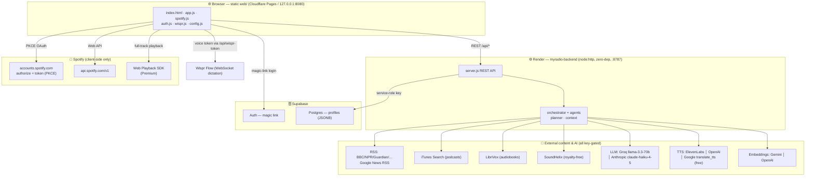
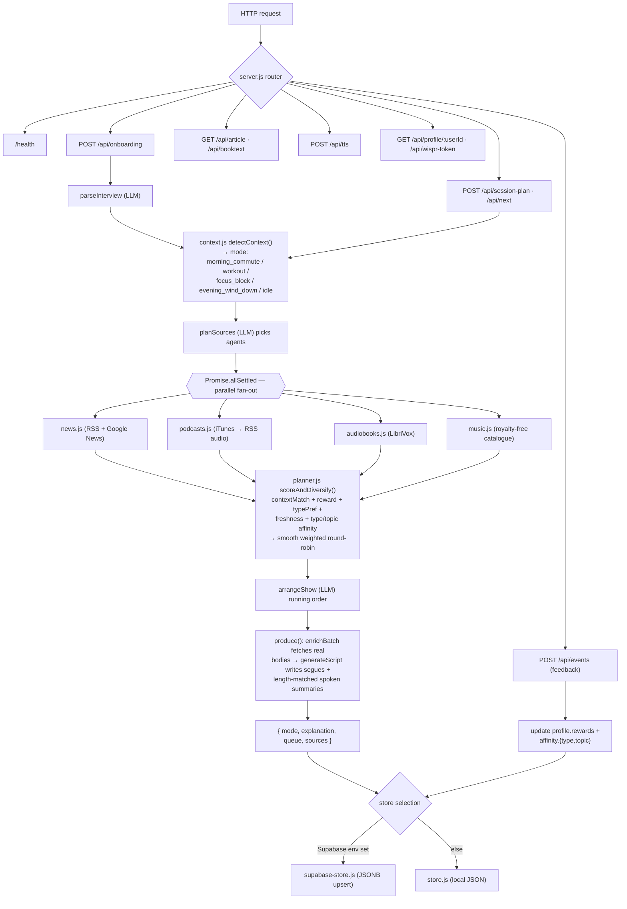
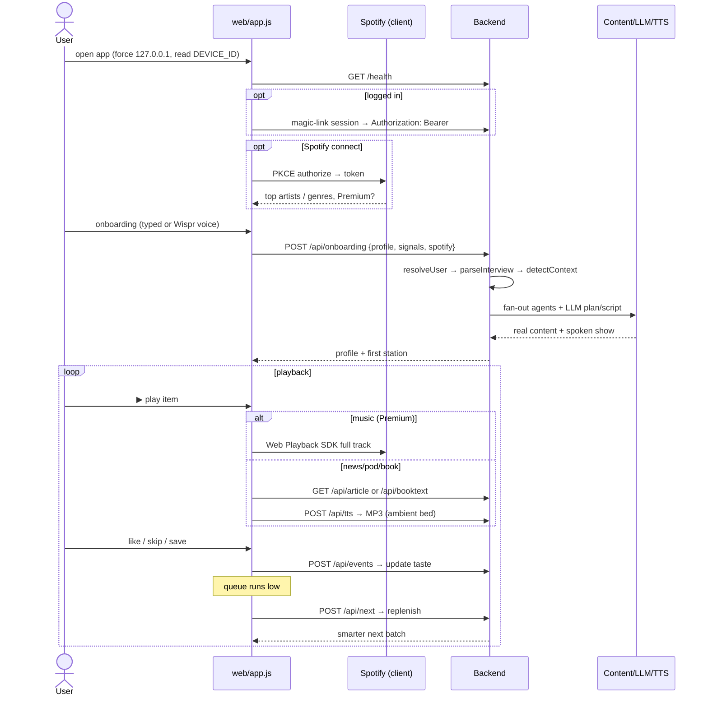
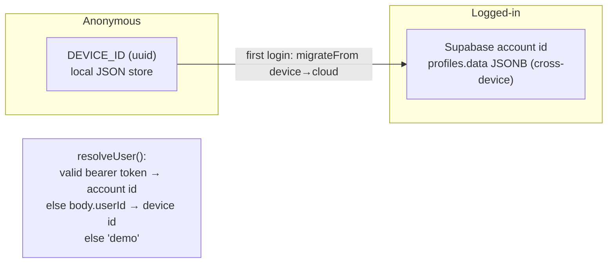

# Architecture

> The tables below describe the **conceptual agent design**. The Mermaid diagrams in
> [System Diagrams (as-built)](#system-diagrams-as-built) document what the code actually
> does today; [Suggested Improvements](#suggested-improvements) lists where they diverge and
> what to do about it.

## System Diagrams (as-built)

### 1. Deployment topology

The backend never calls Spotify — Spotify is entirely client-side; the browser folds the
user's derived top-artists/genres into the onboarding payload. Every external provider is
optional and key-gated, with a deterministic keyless fallback.



### 2. Backend request pipeline



### 3. End-to-end session (login → station → playback → learning)



### 4. Identity tiers & profile migration



## Agents

| Agent | Responsibility |
|---|---|
| **Context** | Raw signals → labels (e.g. `morning_commute`, `focus_block`, `workout`). |
| **Session Planner** | Builds the next queue; balances relevance, freshness, novelty, licensing. |
| **Personalization** | Updates taste profile from explicit + implicit events; keeps per-context prefs separate from global taste. |
| **News** | Fetch by topic/source/region, dedupe into stories, generate cited radio scripts. |
| **Podcast** | Discover/import shows, fetch RSS audio, prepare summaries when allowed. |
| **Audiobook** | Ingest public-domain books/chapters, match to interests/context. |
| **Music** | Rank royalty-free tracks by genre/tempo/energy/mode; Spotify only for Premium. |
| **Voice Producer** | Text summaries → spoken audio (ElevenLabs), per-type voices, stored audio. |
| **Report Correction** | Handle bad-summary / wrong-source / boring / bad-voice reports → feedback to planner. |

## Flow (one session)

```
context signals → Context Agent → mode label
              ↓
content agents fetch/reuse candidates → Content Store
              ↓
Session Planner scores + diversifies (news/podcast/audiobook/music)
              ↓
Voice Producer prepares scripts or original audio URLs
              ↓
App plays item → feedback events → Personalization Agent → better next queue
```

## Scoring (MVP — intentionally simple)

```
score = taste_match + context_match + content_type_preference + freshness
      + explicit_reward + novelty_bonus
      - fast_skip_penalty - fatigue_penalty - license_unavailable_penalty
```

Upgrade path: replace linear scoring with a contextual bandit + pgvector embeddings
once enough real listening data exists.

## Build Roadmap

1. **Backend core** — context agent, session planner, personalization, in-memory store, REST API.
2. **Web demo** — exercise the full loop in the browser.
3. **Content adapters** — News (NewsAPI/Guardian), Podcasts (Listen Notes/RSS), Audiobooks (Gutendex), Music (royalty-free seed).
4. **Voice** — OpenAI summary → ElevenLabs TTS → audio storage.
5. **Persistence** — Postgres + pgvector, object storage for audio.
6. **iOS app** — SwiftUI, AVPlayer, onboarding, permissions, TestFlight.

## Recommended Services (when leaving local scaffold)

OpenAI · ElevenLabs · NewsAPI/Guardian · Listen Notes/Podcast Index · Gutendex ·
Neon/Supabase Postgres · Cloudflare R2/S3 · Upstash Redis · Temporal/Inngest · Sentry · PostHog.

## Suggested Improvements

Ordered roughly by leverage. Each notes the concrete gap in today's code.

### Reliability & correctness
1. **No TTS/content caching → duplicate cost + latency.** `POST /api/tts` re-synthesizes the
   same narration on every play/refresh, and `enrichBatch` re-fetches article bodies. Add a
   content-addressed cache (hash of text/URL → object storage for MP3, short-TTL in-memory or
   Redis for article bodies). This is the single biggest cost and latency win.
2. **Render free tier cold-starts (~30–60s).** First request after idle stalls onboarding.
   Add a cheap keep-warm cron (the existing `monitor/` job could ping `/health`), and show a
   "waking up" state in the client instead of a silent hang.
3. **`sessions` Map is in-process and unbounded.** Session pools live only in one Node process
   (lost on restart/redeploy, and Render may run >1 instance later) and never evict. Move
   session state into Supabase or Redis with a TTL, or at minimum cap + LRU-evict the Map.
4. **No timeout/circuit-breaker budget on fan-out.** `Promise.allSettled` waits on the slowest
   RSS/LLM call; one slow feed drags the whole plan. Wrap each agent call in a per-source
   timeout (`AbortSignal.timeout`) and degrade to whatever returned in time.
5. **LLM/TTS output isn't validated before playback.** `generateScript` output is trusted; a
   malformed or over-length script degrades the show silently. Validate against the JSON schema
   already used in `llm.js` and fall back to the extractive summary on mismatch.

### Security & privacy
6. **CORS is `access-control-allow-origin: *`.** Fine while anonymous, but once magic-link
   tokens flow it lets any origin call the API with a stolen token. Restrict to the known
   frontend origins (Cloudflare Pages + localhost).
7. **No rate limiting or abuse protection on the backend.** Every endpoint fans out to paid
   LLM/TTS providers unauthenticated — a trivial abuse vector. Add per-IP/per-user token-bucket
   limiting on `/api/onboarding`, `/api/next`, `/api/tts`.
8. **`/api/tts` is an open synthesis proxy.** It will synthesize arbitrary posted text on your
   ElevenLabs/OpenAI bill. Gate it behind a session/user and cap length + daily quota.

### Architecture & scale
9. **Server-side embeddings/ranking exists but nothing is persisted.** `embeddings.js` computes
   vectors per request and throws them away. Store them in Supabase **pgvector** so news dedup
   and semantic ranking work across sessions and get cheaper over time — this is the natural
   bridge to the "contextual bandit + pgvector" upgrade path already noted above.
10. **Taste state is one JSONB blob.** Simple and good for now, but read-modify-write on the
    whole profile races under concurrent events and can't be queried analytically. When events
    grow, split an append-only `events` table from the derived `profile` snapshot.
11. **Producer LLM calls are on the hot path and serial-ish.** `planSources` → agents →
    `arrangeShow` → `generateScript` runs on every plan. Prefetch the *next* batch during
    playback (the client already does `ensureAhead`; move more of that work server-side and
    cache it) so refills feel instant.
12. **Provider selection is implicit (first key wins).** `provider()` silently picks Groq over
    Anthropic. Make it explicit via a `LLM_PROVIDER` env and log the resolved provider/model at
    boot so deploys are debuggable.

### Observability
13. **No structured logging, metrics, or error tracking.** Add request logging with timing per
    stage (context → fan-out → score → produce), and wire Sentry/PostHog (already on the
    recommended list) so skips, cold-starts, and provider failures are visible in production.
14. **CI covers the loop but not the providers.** `monitor/` exercises onboarding→playback
    keyless; add a smoke test that runs one plan with each provider key set to catch API/schema
    drift (e.g. an Anthropic Messages API change) before users hit it.
